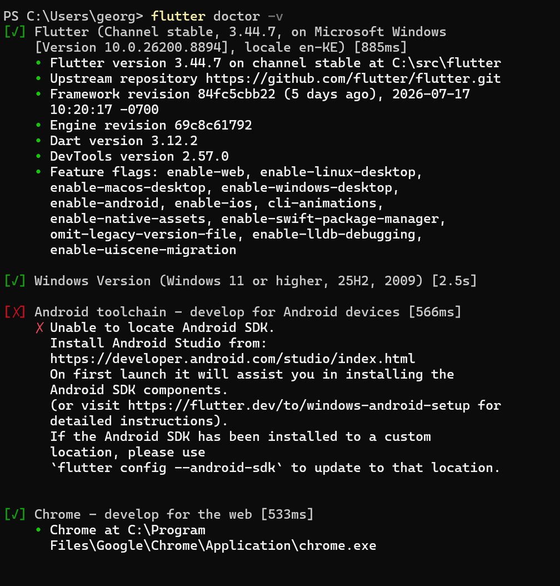
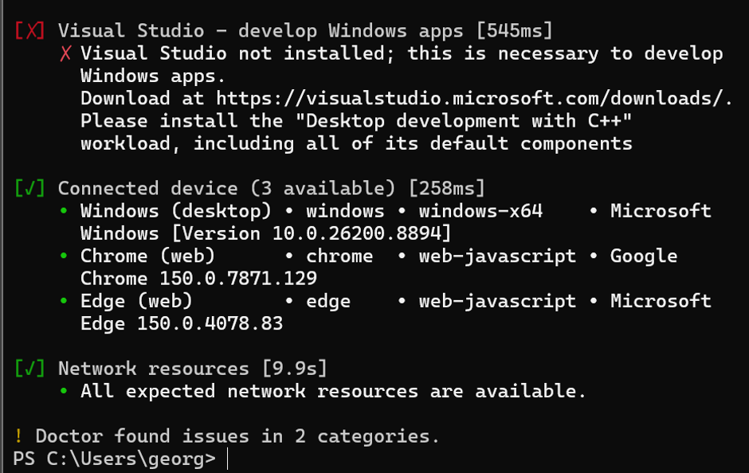
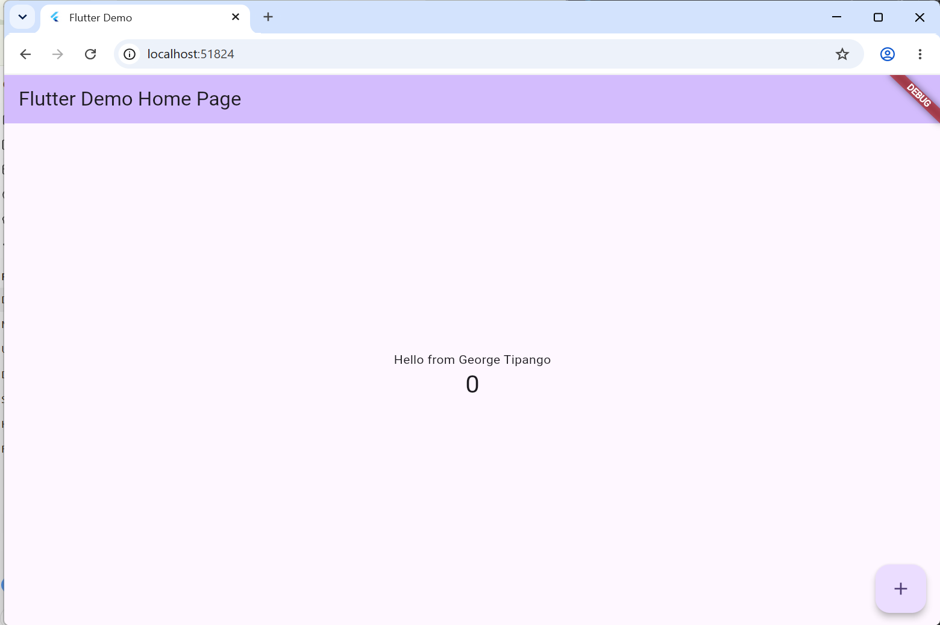
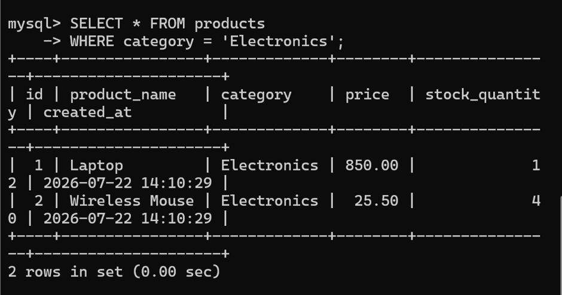

# Lab 3 – Flutter and MySQL Assignment

- **Assignment:** Lab 3 – Flutter Environment Audit and MySQL Database Design

---

## Project Overview

This project demonstrates the completion of Lab 3, which consists of two practical exercises:

### Exercise A – Flutter Environment Audit

The following tasks were completed:

- Installed and configured Flutter SDK.
- Verified the Flutter installation using `flutter doctor -v`.
- Created a Flutter project named `lab3_flutter`.
- Modified the default Flutter application by replacing the text:

```
You have pushed the button this many times:
```

with

```
Hello from George Tipango
```

- Successfully ran the application and verified Hot Reload.

---

### Exercise B – MySQL Database Design

The following database tasks were completed:

- Created a database named `lab3_db`.
- Created a `products` table with the required columns:
  - `id`
  - `product_name`
  - `category`
  - `price`
  - `stock_quantity`
  - `created_at`
- Inserted five sample product records.
- Executed the required SQL queries:
  - Display all products.
  - Display only Electronics products.
  - Display products sorted by price.

---

## Files Included

- `lib/main.dart` – Modified Flutter application.
- `Lab3_Worksheet_George_Tipango.docx` – Completed lab worksheet.
- `README.md` – Project documentation.

---

## Technologies Used

- Flutter 3.44.7
- Dart 3.12.2
- MySQL Community Server
- Visual Studio Code
- Git
- GitHub

---

---

# Screenshots

## 1. Flutter Doctor (Part 1)



## 2. Flutter Doctor (Part 2)



## 3. Flutter Application Running



## 4. MySQL Products Table Created


## 5. Insert Sample Products



## 6. Display Products Query

